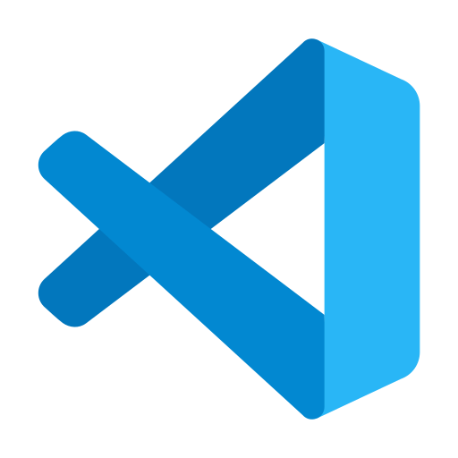

<p align="center">
  
</p>

<p align="center">
  <a href="https://www.linkedin.com/in/sameer-rahil/">
    
  </a>
  
</p>

---

## Hi, I am Sameer

I am pursuing a **Bachelor's in Computer Science with a focus on AI at Lahore University of Management Sciences (LUMS)**.

I build across **AI, software engineering, product systems, machine learning research, network security, and AI-assisted development workflows**. I like projects that are useful in the real world, technically interesting under the hood, and polished enough that someone else can actually use them.

```txt
builder first
researcher with depth
software engineer by practice
```

---

## Featured Build: Loop. App

**Loop. App** is my main software engineering showcase.

It grew out of the **Glide** campus event discovery and management platform, built around a simple idea: students should be able to discover campus events, RSVP, track capacity, and stay connected to what is happening around them without chaos.

| What Loop. App Shows | Why It Matters |
|---|---|
| Event discovery | Helps students find relevant campus events quickly |
| RSVP and capacity flows | Handles real user actions, not just static pages |
| Organizer tools | Supports event creation and management |
| Product thinking | Turns a campus pain point into a usable system |
| Software engineering process | Connects requirements, backlog work, implementation, and iteration |

> Useful, social, technical, and grounded in a real problem. That is the kind of software I enjoy building.

**Repository:** [CS360S26glide/glide](https://github.com/CS360S26glide/glide)

---

## What I Work On

| Area | What I Do |
|---|---|
| Product Engineering | Build useful apps with clear flows, real users, and maintainable structure |
| Machine Learning | Work on model evaluation, OOD detection, interpretability, and applied ML |
| AI Agents and Tools | Use ChatGPT, Claude Code, Gemini, Colab, Kaggle, and AI workflows for faster research and development |
| Software Engineering | Plan, implement, document, and improve systems through proper engineering practice |
| Security and Networks | Explore network-centric computing, XSS, CSRF, web security, and protocol-level thinking |
| Backend Systems | Build APIs and backend workflows using tools like FastAPI and Docker |

---

## Machine Learning and Research

I have worked on ML-heavy coursework and research through **Advanced Topics in Machine Learning**, including:

- Domain adaptation
- OOD generalization
- Discriminative and generative models
- Contrastive learning
- Federated learning
- Model evaluation under distribution shift
- Mechanistic interpretability and open-set recognition

A major research thread I have explored is understanding why models fail when the input distribution changes. That includes harmful versus useful feature analysis, OOD scoring, SALVE-style interpretability, and visual evidence such as Grad-CAM style explanations.

The questions I care about are:

```txt
What did the model actually learn?
Why did it fail?
Which internal feature caused the failure?
Can we make the behavior more reliable?
```

---

## Advanced ML Work

| Repository | Focus |
|---|---|
| [Advanced-Topics-in-Machine-Learning-PA1](https://github.com/SameerRahil/Advanced-Topics-in-Machine-Learning-PA1) | Advanced ML assignment work |
| [Advanced-Topics-in-Machine-Learning-PA2](https://github.com/SameerRahil/Advanced-Topics-in-Machine-Learning-PA2) | ML experimentation and evaluation |
| [Advanced-Topics-in-Machine-Learning-PA3](https://github.com/SameerRahil/Advanced-Topics-in-Machine-Learning-PA3) | Advanced model behavior and learning setup |
| [Advanced-Topics-in-Machine-Learning-PA4](https://github.com/SameerRahil/Advanced-Topics-in-Machine-Learning-PA4) | Federated learning and heterogeneity |
| [Advanced-Topics-in-Machine-Learning-PA5](https://github.com/SameerRahil/Advanced-Topics-in-Machine-Learning-PA5) | Mechanistic interpretability and LLMs |
| [FedSCAM](https://github.com/SameerRahil/FedSCAM) | Federated learning and ML research experimentation |

---

## Retro Skill Board

```txt
[AI/ML]        Python  PyTorch  Scikit-learn  Pandas  NumPy  Hugging Face
[Agents]       ChatGPT  Claude Code  Gemini  AI Workflows  Prompting
[Research]     Google Colab  Kaggle  Notebooks  Experiments  Model Evaluation
[Backend]      FastAPI  Node.js  APIs  Auth  Databases
[Systems]      C  C++  x86 Assembly  Linux  Docker  Networking
[Security]     XSS  CSRF  Web Security  Network-Centric Computing
[Frontend]     HTML  CSS  JavaScript  React
[Workflow]     Git  GitHub  Slack  Notion  Obsidian  VS Code
```

---

## Toolchain

<p align="center">
  
  &nbsp;&nbsp;&nbsp;
  
  &nbsp;&nbsp;&nbsp;
  
  &nbsp;&nbsp;&nbsp;
  
  &nbsp;&nbsp;&nbsp;
  
  &nbsp;&nbsp;&nbsp;
  
  &nbsp;&nbsp;&nbsp;
  
  &nbsp;&nbsp;&nbsp;
  
  &nbsp;&nbsp;&nbsp;
  
  &nbsp;&nbsp;&nbsp;
  
</p>

<p align="center">
  
  &nbsp;&nbsp;&nbsp;
  
  &nbsp;&nbsp;&nbsp;
  
  &nbsp;&nbsp;&nbsp;
  
  &nbsp;&nbsp;&nbsp;
  
  &nbsp;&nbsp;&nbsp;
  
  &nbsp;&nbsp;&nbsp;
  
  &nbsp;&nbsp;&nbsp;
  
  &nbsp;&nbsp;&nbsp;
  
</p>

<p align="center">
  
  &nbsp;&nbsp;&nbsp;
  
  &nbsp;&nbsp;&nbsp;
  
  &nbsp;&nbsp;&nbsp;
  
  &nbsp;&nbsp;&nbsp;
  
  &nbsp;&nbsp;&nbsp;
  
</p>

<p align="center">
  
  &nbsp;&nbsp;&nbsp;
  
  &nbsp;&nbsp;&nbsp;
  
  &nbsp;&nbsp;&nbsp;
  
</p>

<p align="center">
  
</p>
---

## Tiny System Status

```txt
sameer@github:~$ status

current_mode       building + learning
main_project       Loop. App
research_thread    reliable ML and model behavior
engineering_focus  useful products, clean systems, better workflows
security_thread    XSS, CSRF, networks, and web security fundamentals
ai_stack           ChatGPT, Claude Code, Gemini, AI agents, research acceleration
favorite_question  "what is actually happening under the hood?"
```

---

## Interests

<p align="center">
  
</p>

---

## Connect

<p align="center">
  <a href="https://www.linkedin.com/in/sameer-rahil/">
    
  </a>
</p>

<p align="center">
  <b>Building software, studying intelligence, and trying to make systems that are actually useful.</b>
</p>
